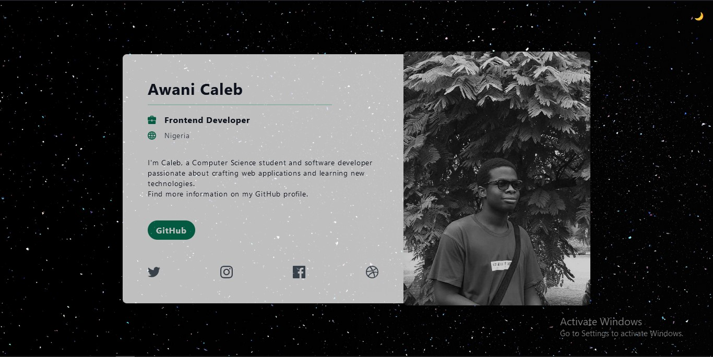

# My Profile Card  

Welcome to my **Profile Card**—a single-page portfolio template built with [Tailwind CSS](https://tailwindcss.com/). Originally created as a template by Tailwind Toolbox, I’ve customized it to showcase my skills, projects, and interests.  

  

## About  

This profile card serves as a simple and sleek way to introduce myself:  

- **Who I Am:** A Computer Science student passionate about backend development and web application design.  
- **What I Do:** I build efficient, user-friendly applications, experiment with APIs, and implement payment systems.  
- **My Goal:** To keep learning, growing, and collaborating with other developers.  

## Features  
The page includes:  
- A responsive and modern design powered by Tailwind CSS.  
- A customizable section for my contact links. 
- Easy-to-edit HTML and Tailwind CSS structure for quick updates.  

## How to Use  
Feel free to use this as a base for your own portfolio!  

### Options to Get Started:  
- Clone this repository:  
  ```bash  
  git clone https://github.com/awanicaleb/Profile-Card.git
- Modify the HTML content in index.html to include your details.
- Customize the Tailwind CSS styles to make it truly yours.

## Features  
Working on this project helped me:
- Understand the power of Tailwind CSS for building responsive layouts.
- Practice creating clean and concise HTML templates.
- Develop a lightweight, customizable portfolio page.

## License  
This project is open-source and available under the MIT License.
